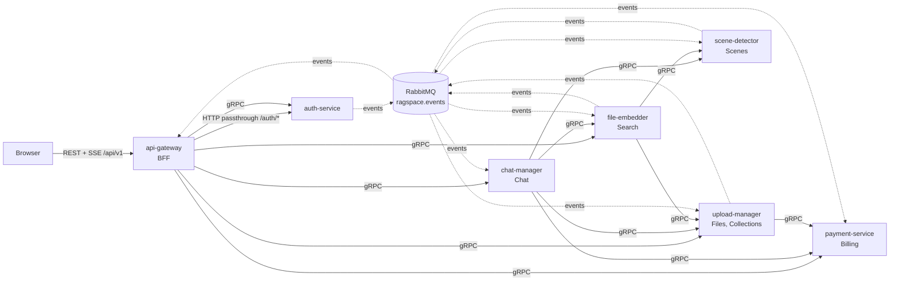

# API Redesign: public REST + internal gRPC

Status: **proposed, awaiting review.** No service code has changed yet.

| Artifact | Path |
|---|---|
| Public API spec (OpenAPI 3.1) | [`contracts/openapi/public.v1.yaml`](../contracts/openapi/public.v1.yaml) |
| Internal RPC + event contracts (Protobuf) | [`contracts/proto/ragspace/`](../contracts/proto/ragspace) |
| buf config (lint: STANDARD, breaking: FILE) | [`contracts/buf.yaml`](../contracts/buf.yaml) |

## 1. Why

Today every service exposes ad-hoc HTTP routes that are used for three things at once: browser traffic (through the gateway's catch-all proxy), service-to-service calls, and admin/maintenance. The result:

- **~88 HTTP routes** with no clear public/internal boundary. Internal-only routes (`/usage/decrement`, `/metadata/*`, `/upload/:id` state updates) are reachable from the browser.
- **Trust by header.** Services accept `x-user` / `x-service` JSON headers as proof of identity, and the gateway forwards client-supplied headers. See [§8](#8-problems-found-in-the-current-system).
- **Untyped internal calls.** Clients build URLs by hand. Several call paths that do not exist (`/api/usage/check` on a service with no `/api` prefix), and then fail open.
- **Inconsistent shapes.** snake_case for chat and search, camelCase elsewhere. Pagination is a mix of page/limit, offset/limit and none.

## 2. Decisions

| Topic | Decision |
|---|---|
| Public API | REST + OpenAPI 3.1 at `/api/v1`, owned by the gateway. The spec is the source of truth and is enforced at runtime. |
| Internal calls | gRPC + Protobuf. `.proto` files replace the JSON Schema contracts. |
| Async pipeline | RabbitMQ stays, for events only. Payloads are defined in `events/v1/events.proto`. |
| Gateway role | Backend-for-frontend: real controllers per resource, calling gRPC. No more catch-all proxy. |
| Authentication | Only at the gateway. Internal services never authenticate callers: no auth guards, auth interceptors, tokens or identity headers. They are reachable only on the private Docker network. |
| Auth exception | `/api/v1/auth/*` stays an HTTP passthrough to auth-service, because better-auth needs cookies and OAuth redirects. Session validation is RPC. |
| Live updates | Server-Sent Events at `GET /api/v1/events`, replacing the WebSocket. One-way, cookie auth, auto-reconnect, no upgrade proxying. |
| Processing state | Single writer: upload-manager. Workers report via `file.stage_changed` events; the HTTP state-update route goes away. |
| Cross-service cleanup | Event driven (`user.deleted`, `file.deleted`, `collection.deleted`). No HTTP fan-out, no commented-out cleanup. |
| Visual metadata | Owned by file-embedder, which generates it. Stored as metadata on its ChromaDB records next to the embedding it describes, and returned inside search hits and file content. upload-manager's `FileMetadata` table and the 13 `/metadata/*` routes go away, and chat-manager no longer needs metadata reads or S3 access. |

## 3. Architecture

- Only the gateway is published to the host. Internal services listen on gRPC `:50051` plus HTTP `:8080` for `GET /health`, and are reachable only on the Docker network. That network boundary is the trust boundary, which is why services carry no auth code.
- The gateway holds no business logic. It authenticates, validates against the spec, rate limits, calls RPCs, maps proto to public DTOs, and composes responses where one screen needs two services (`GET /usage` = billing + files).

## 4. Public API (47 operations)

Full detail is in the spec; its `info.description` lists every convention, and [§4.1](#41-best-practices-applied) summarizes them.

| Area | Operations | Backed by |
|---|---|---|
| System | `GET /health` | gateway |
| Auth | `POST /auth/sign-up`, `POST /auth/sign-in`, `POST /auth/sign-out`, `GET /auth/oauth/{provider}`, `GET /auth/oauth/{provider}/callback`, `POST /auth/password/forgot`, `POST /auth/password/reset`, `POST /auth/password/change` | auth-service (HTTP passthrough) |
| Account | `GET /me`, `PATCH /me`, `DELETE /me` | `AuthService` |
| Uploads | `POST /uploads`, `POST /uploads/{fileId}/complete`, `DELETE /uploads/{fileId}` | `FileService` |
| Files | `GET /files`, `POST /files` (import from URL), `GET /files/{fileId}`, `PATCH /files/{fileId}`, `DELETE /files/{fileId}`, `POST /files/{fileId}/reprocess` | `FileService` |
| Events | `GET /events` (SSE: `files.snapshot`, `file.updated`) | gateway (RabbitMQ `file.updated`) + `FileService` for the snapshot |
| Collections | `GET /collections`, `POST /collections`, `GET /collections/{id}`, `PATCH /collections/{id}`, `DELETE /collections/{id}`, `GET /collections/{id}/items`, `POST /collections/{id}/files`, `DELETE /collections/{id}/files?ids=` | `CollectionService` |
| Search | `POST /search` | `SearchService` (+ `CollectionService` to resolve `collectionId`) |
| Conversations | `GET /conversations`, `POST /conversations`, `GET /conversations/{id}`, `DELETE /conversations/{id}`, `GET /conversations/{id}/messages`, `POST /conversations/{id}/messages` (SSE), `GET /assistant/greeting` | `ChatService` |
| Billing | `GET /plans`, `GET /subscription`, `POST /subscription/change-plan`, `POST /subscription/cancel`, `POST /subscription/pause`, `POST /subscription/resume`, `DELETE /subscription/scheduled-change`, `GET /usage` | `BillingService` (+ `FileService` for storage) |
| Webhooks | `POST /webhooks/{provider}` | `BillingService.HandleWebhook` |

Notable simplifications:
- **One upload flow.** Every upload is a multipart session; small files get one part. The multer `POST /upload` path (unused by the frontend) is removed. The S3 key, size and multipart `UploadId` stay server-side; the upload is addressed by its file id and the client sends only part ETags on complete.
- **One session check.** `GET /me` replaces both `/auth/me` and `/auth/session`.
- **Enriched hits.** Search hits and chat results carry visual descriptions and presigned URLs, so clients and chat-manager need no follow-up lookups.
- **Two-step chat.** `POST /conversations` (quota checked here), then stream with `POST /conversations/{id}/messages`. The `conversation_id`, `metadata` and `[DONE]` stream events disappear. 12 SSE event types collapse to 6: `step`, `tool`, `results`, `delta`, `done`, `error`.
- **One plan-change endpoint.** checkout, upgrade and downgrade become `POST /subscription/change-plan`; the service decides which applies.
- **One usage endpoint.** `/usage/stats`, `/usage/remaining`, `/usage/history`, `/subscriptions/usage`, `/upload/storage/stats` and the four `/validation/*` routes become `GET /usage` (plus `GET /subscription` for plan and features).
- **Search knobs are internal.** `text_weight`, `threshold`, `use_enhanced` and the other tuning flags, and the client-supplied `user_id`, are removed from the public request.
- **No storage internals.** S3 keys and buckets never appear in responses; URLs are presigned by the service that returns them.

### 4.1 Best practices applied

| Area | Practice |
|---|---|
| Resources | Plural nouns, ids in paths; actions only where no resource fits (`/reprocess`, `/subscription/change-plan`). Membership uses `POST` (add) and `DELETE ?ids=` (remove), both idempotent. |
| Methods | `PATCH` follows JSON Merge Patch semantics (RFC 7396). Non-idempotent `POST`s take `Idempotency-Key`; every other write is idempotent by design. |
| Status codes | `201` + `Location` on create, `202` for async work, `204` for empty success, `402` for plan limits, `429` for rate limits, `409` for state conflicts. Every operation documents `429` and a `default` problem response. |
| Errors | RFC 9457 `application/problem+json` with a stable `code` enum, field-level `errors`, and quota details. |
| Input safety | Request schemas set `additionalProperties: false`; every request string, integer and array is bounded; ids match `^[A-Za-z0-9_-]{1,64}$`; mutually exclusive fields are enforced with `not.required`. |
| Output | Every documented field is always present (`null` when absent); explicit `int32`/`int64` formats; typed discriminated unions for SSE events and collection items. |
| Evolution | `/api/v1` path versioning; strict input but tolerant output (clients ignore unknown fields and enum values), so additive changes are non-breaking. |
| Security | httpOnly SameSite=Lax session cookie, no tokens in JS; `Origin` check on unsafe methods; fresh session required for account deletion; no account enumeration on password reset; `redirectTo` restricted to same-origin paths (blocks `//` and `/\` open redirects); search query kept out of URLs. |
| Pagination | Opaque cursors with `{ items, nextCursor }`, bounded `limit` (1-100, default 20), and explicit sort order per list. |
| Operability | `X-Correlation-Id` and `RateLimit-*` headers on every response; `Retry-After` on `429`; `Cache-Control: no-store` on authenticated responses. |

Lint status: Redocly `recommended` passes with 0 warnings and `buf lint` (STANDARD) passes. Spectral with the OWASP API Security ruleset reports no request-side findings. Its remaining findings are deliberate:
- `401`/write-restricted on intentionally public operations (sign-up, webhooks).
- CORS headers, which don't apply because the API is same-origin.
- Length limits on response strings.
- Per-response rate-limit headers, which are documented once in the conventions.

## 5. Internal RPC

### Services

| Proto service | Owner | RPCs | Called by |
|---|---|---|---|
| `auth.v1.AuthService` | auth-service | ValidateSession, GetUser, UpdateUser, DeleteUser | gateway |
| `files.v1.FileService` | upload-manager | GetFile, BatchGetFiles, ListFiles, RenameFile, DeleteFile, ReprocessFile, CreateUpload, CompleteUpload, AbortUpload, ImportFile, GetStorageStats | gateway, chat, search |
| `files.v1.CollectionService` | upload-manager | Create/Get/List/Update/DeleteCollection, ListCollectionItems, AddCollectionFiles, RemoveCollectionFiles, ResolveCollectionFileIds | gateway, chat |
| `scenes.v1.SceneService` | scene-detector | ListScenes, BatchGetScenes | chat, search |
| `search.v1.SearchService` | file-embedder | Search, GetFileContent (replaces `/content/video` + `/content/file`). Hits and content include visual descriptions and presigned URLs. | gateway, chat |
| `chat.v1.ChatService` | chat-manager | Create/List/Get/DeleteConversation, ListMessages, SendMessage (server stream), GetGreeting | gateway |
| `billing.v1.BillingService` | payment-service | ListPlans, GetSubscription, ChangePlan, Cancel/Pause/ResumeSubscription, CancelScheduledChange, GetUsage, ConsumeQuota, ReleaseQuota, HandleWebhook | gateway, files, chat |

### Cross-cutting rules

- **No authentication in services.** The gateway authenticates every request through `AuthService.ValidateSession` and is the only entry point. Services accept any RPC that reaches them; there are no auth guards, auth interceptors or tokens outside the gateway and auth-service.
- **User scoping.** User-scoped requests carry an explicit `user_id`, which the gateway takes from the validated session and never from client input. Services filter every query by it (`where: { id, userId }`), so a foreign id returns `NOT_FOUND`. This is data scoping, not an auth check.
- **Metadata.** Every RPC carries `x-correlation-id` for logging.
- **Deadlines** (client side, per CLAUDE.md "per-service timeouts"):

  | Call | Deadline |
  |---|---|
  | `AuthService.ValidateSession` | 2s (gateway caches results for up to 30s) |
  | `FileService` / `CollectionService` / `SceneService` | 5s (`CreateUpload` 10s) |
  | `BillingService` | 3s |
  | `SearchService.Search` | 15s; `GetFileContent` 30s |
  | `ChatService` unary | 5s |
  | `ChatService.SendMessage` | no total deadline; 120s idle timeout between events |

- **Idempotency.** Non-idempotent RPCs carry a `request_id` (AIP-155). The gateway fills it from the client's `Idempotency-Key`; services derive it from the operation (e.g. `upload:<fileId>` for quota).
- **Retries.** Through gRPC service config: reads retry on `UNAVAILABLE` up to 3 times with exponential backoff and jitter. Writes retry only when they carry a `request_id`.
- **Quota failures fail closed.** If `ConsumeQuota` is unreachable, the caller returns `UNAVAILABLE`. Today's fail-open behavior combined with broken URLs means quotas are not enforced at all.
- **Errors.** Services return standard gRPC codes plus trailing metadata `x-error-code` (and `x-quota-metric` / `-used` / `-limit` for quota). The gateway maps them:

  | gRPC | HTTP | `code` |
  |---|---|---|
  | INVALID_ARGUMENT | 400 | validation_failed |
  | UNAUTHENTICATED | 401 | unauthenticated |
  | PERMISSION_DENIED | 403 | forbidden |
  | NOT_FOUND | 404 | not_found |
  | ALREADY_EXISTS, ABORTED, FAILED_PRECONDITION | 409 | conflict |
  | RESOURCE_EXHAUSTED | 402 | quota_exceeded |
  | UNAVAILABLE | 503 | upstream_unavailable |
  | DEADLINE_EXCEEDED | 504 | upstream_timeout |
  | anything else | 500 | internal |

  The gateway's own rate limiter returns 429 `rate_limited`.
- **Pagination.** `page_size` (default 20, max 100) and opaque `page_token` / `next_page_token` (AIP-158). The gateway passes these through as `limit` / `cursor` / `nextCursor`.
- **Batch limits.** `Batch*` RPCs and id lists accept at most 100 ids.
- **Health.** Each service implements `grpc.health.v1.Health` and keeps `GET /health` on `:8080` for Docker healthchecks.
- **Scaling.** gRPC holds long-lived HTTP/2 connections. With more than one replica per service, clients use `dns:///<service>:50051` with `round_robin` load balancing.

## 6. Events (RabbitMQ)

One durable topic exchange, `ragspace.events`. Each message body is an `Envelope` (protobuf JSON mapping), and the routing key is `Envelope.type`. Each consuming service owns one durable queue with a DLQ. Consumers dedupe on `Envelope.id`, ack manually after success, and use `nack(requeue=false)` for permanent errors.

| Routing key | Producer | Consumers | Replaces |
|---|---|---|---|
| `user.created` | auth (better-auth `databaseHooks`) | billing: create free subscription | auth → `POST /subscriptions/free` |
| `user.deleted` | auth | files, scenes, search, chat, billing: purge everything | commented-out HTTP fan-out; the old event went to an exchange with no consumers |
| `file.uploaded` | files | scenes, search (transcript) | `file.upload.completed` |
| `file.stage_changed` | scenes, search | files (applies forward-only) | `PUT /upload/:id` + `file.processing.{started,progress,retrying,failed}`, `file.indexing.completed` |
| `file.scenes_detected` | scenes | search (visual embeddings; pages scenes via `SceneService.ListScenes`) | `file.processing.completed` (which carried every scene inline) |
| `file.updated` | files | gateway (SSE fan-out to the owner) | upload-manager WS fan-out queue |
| `file.deleted` | files | scenes, search, chat | `file.deleted` + file-embedder → `POST /conversations/batch/files/delete` |
| `collection.deleted` | files | chat | `POST /conversations/batch/collections/delete` |

Dropped as unused or client-side only: `file.upload.started`, `file.upload.progress`, `file.upload.failed`, `file.scene.detection.*`.

The gateway binds an exclusive, auto-delete queue per instance to `file.updated`. Every instance receives every update and delivers it to its own connected users, so the gateway scales horizontally without sticky sessions.

## 7. Old → new mapping

**Removed** means the capability moved to an event, an internal RPC, or was unused.

### auth-service
| Old | New |
|---|---|
| `POST /auth/signup` | `POST /auth/sign-up` |
| `POST /auth/signin` | `POST /auth/sign-in` |
| `GET /auth/google/login`, `GET /auth/google/callback` | `GET /auth/oauth/{provider}`, `.../callback` |
| `GET /auth/session` | `GET /me` (browser); `AuthService.ValidateSession` (gateway) |
| `GET /auth/me` | `GET /me` |
| `POST /auth/change-password` | `POST /auth/password/change` |
| `POST /auth/forgot-password`, `/auth/forget-password` rewrite | `POST /auth/password/forgot` |
| better-auth `reset-password` rewrite | `POST /auth/password/reset` |
| `DELETE /auth/account` | `DELETE /me` |
| frontend `/auth/logout`, `PATCH /auth/profile` (no backend handler found) | `POST /auth/sign-out`, `PATCH /me` |
| `GET /auth/health` | `GET /health` (per service) |

### upload-manager
| Old | New |
|---|---|
| `POST /upload` (multer) | **Removed**; use `POST /uploads` for every size |
| `POST /upload/multipart/init` | `POST /uploads` |
| `POST /upload/multipart/complete` | `POST /uploads/{fileId}/complete` |
| `DELETE /upload/multipart/abort/:fileId` | `DELETE /uploads/{fileId}` |
| `POST /upload/youtube` | `POST /files` `{ url }` |
| `GET /upload` | `GET /files` |
| `GET /upload/:id` | `GET /files/{fileId}` |
| `PUT /upload/:id` | `PATCH /files/{fileId}` (name only); processing state through `file.stage_changed` |
| `DELETE /upload/:id` | `DELETE /files/{fileId}` |
| `POST /upload/:id/reprocess` | `POST /files/{fileId}/reprocess` |
| `GET /upload/storage/stats` | `GET /usage` → `storage` |
| `DELETE /upload/user-data` | **Removed**; `user.deleted` consumer |
| `WS /ws/upload-events` | `GET /events` (SSE) |
| `/metadata/*` (13 routes) and the `FileMetadata` table | **Removed**; visual metadata moves into file-embedder's ChromaDB records |
| `GET /collections`, `GET /collections/flat` | `GET /collections?parentId=` |
| `GET /collections/:id` (with items) | `GET /collections/{id}` + `GET /collections/{id}/items` |
| `GET /collections/:id/files` | `GET /files?collectionId=` |
| `POST /collections/:id/files`, `DELETE /collections/:id/files` (body) | `POST /collections/{id}/files`, `DELETE /collections/{id}/files?ids=` |
| `POST`, `PATCH`, `DELETE /collections[/:id]` | same paths under `/api/v1` |

### payment-service
| Old | New |
|---|---|
| `GET /plans`, `GET /plans/with-comparison` | `GET /plans` (comparison when signed in) |
| `GET /plans/:id` | **Removed**; the list is small, so filter client-side |
| `POST /plans`, `PATCH /plans/:id`, `PATCH /plans/:id/deactivate` | **Removed** from the API; seed or migration only (they are currently exploitable, see §8) |
| `POST /subscriptions/free` | **Removed**; `user.created` consumer |
| `GET /subscriptions/current` | `GET /subscription` |
| `GET /subscriptions/usage`, `GET /usage/stats`, `/usage/remaining`, `/usage/history` | `GET /usage` (history dropped; unused) |
| `POST /subscriptions/checkout`, `PATCH /upgrade`, `PATCH /downgrade` | `POST /subscription/change-plan` |
| `DELETE /subscriptions/cancel` | `POST /subscription/cancel` |
| `PATCH /subscriptions/pause`, `/resume` | `POST /subscription/pause`, `/resume` |
| `DELETE /subscriptions/scheduled-change` | `DELETE /subscription/scheduled-change` |
| `POST /usage/check`, `/usage/track`, `/usage/decrement` | **Internal only**: `ConsumeQuota`, `ReleaseQuota` |
| `GET /validation/plan-type`, `/features`, `POST /feature`, `POST /bulk` | **Removed**; `GET /subscription` / `GetUsage` |
| `POST /webhooks/lemon-squeezy`, `/razorpay` (and the duplicate non-`/api` routes) | `POST /webhooks/{provider}` |

### chat-manager
| Old | New |
|---|---|
| `POST /chat` (creates on first message) | `POST /conversations` + `POST /conversations/{id}/messages` |
| `GET /conversations` (unpaginated) | `GET /conversations` (cursor) |
| `GET /conversations/:id` (all messages inline) | `GET /conversations/{id}` + `GET /conversations/{id}/messages` |
| `DELETE /conversations/:id` | same |
| `DELETE /conversations/file/:id`, `/collection/:id`, `POST /batch/files/delete`, `/batch/collections/delete` | **Removed**; `file.deleted`, `collection.deleted`, `user.deleted` consumers |
| `GET /greeting` | `GET /assistant/greeting` |
| Metadata reads from upload-manager and its own S3 URL signing | **Removed**; search hits arrive with visual descriptions and presigned URLs |

### file-embedder
| Old | New |
|---|---|
| `POST /embed/search/advanced` | `POST /search` (public) / `SearchService.Search` |
| `POST /embed/content/video`, `/embed/content/file` | `SearchService.GetFileContent` (internal) |
| `DELETE /embed/user/:id` | **Removed**; `user.deleted` consumer |
| Visual metadata writes to upload-manager `/metadata/*` | Stored on its own ChromaDB records |

### scene-detector
| Old | New |
|---|---|
| `GET /scenes`, `GET /scenes/:id` | `SceneService.ListScenes`, `BatchGetScenes` (internal). The gateway route `/api/scene/*` never matched the `/scenes` prefix, so these were never publicly reachable anyway. |
| `DELETE /scenes/user/:id` | **Removed**; `user.deleted` consumer |

## 8. Problems found in the current system

Found while inventorying. The redesign fixes all of them structurally, but the first group is exploitable now and should be hotfixed before the refactor lands.

**Exploitable now**
1. **Header spoofing → unauthenticated plan tampering (critical).** The gateway marks every `/api/plans*` path public and forwards client-supplied headers. payment-service trusts any request carrying `x-service` + `x-user`. So anyone can `POST /api/plans` or `PATCH /api/plans/:id` (prices, limits) without signing in. Code: `api-gateway/src/guards/auth.guard.ts` (`publicRoutePrefixes`), `api-gateway/src/modules/proxy/proxy.controller.ts` (`{ ...req.headers }`), `payment-service/src/common/guards/auth.guard.ts`.
2. **Quota self-reset (high).** `POST /api/usage/decrement` and `/track` are reachable by any signed-in user, who can lower their own usage counters.
3. **File IDOR (high).** `PUT /api/upload/:id` calls `updateFile(id, body)` without a user check, and the DTO accepts processing state. Any user can rename or alter any file by id.
4. **Committed OAuth secret (high).** The Google client secret is hardcoded in `auth-service/auth.ts`. Rotate it in Google Cloud Console and load it from env.
5. **Cross-user access (medium).** `POST /api/subscriptions/free` (`@Public`, arbitrary `userId`) and `POST /api/validation/bulk` (arbitrary `userIds`) are callable by any signed-in user.

**Broken behavior**
6. **Quotas are not enforced.** Internal clients call `/api/usage/*` and `/api/validation/*`, but payment-service has no `/api` prefix. upload-manager's `.env.docker` also has no `PAYMENT_SERVICE_URL`, so it calls `localhost:8006` inside its own container. Every check errors, and the clients then fail open. auth-service's sign-up call to `/api/subscriptions/free` uses the same wrong prefix.
7. **Account deletion orphans data.** `user.deleted` goes to the `user.events` exchange, which only auth-service itself binds. The HTTP cleanup calls are commented out. Files, S3 objects, embeddings, scenes, conversations and subscriptions all survive account deletion.
8. **Quota race.** Check-then-track is not atomic, so concurrent requests can both pass the check.
9. **Account enumeration.** forgot-password returns 404 "No account found" for unknown emails.
10. **CSRF protection off.** better-auth has `disableCSRFCheck` and `disableOriginCheck` enabled while using cookie auth, and the secret falls back to `default_secret_key`.
11. **Token in JS storage.** The session token is kept in `sessionStorage` and sent as a Bearer header alongside the cookie.
12. **32-bit file size.** `File.fileSize` is a Prisma `Int`, so files over 2 GiB overflow. The new contract uses `int64`; this needs a `BigInt` migration.
13. **Contract drift.** `ProcessingStatus.SKIPPED` exists in Prisma and the frontend but not in `contracts/`. Fixed in `common.proto`.
14. **Unpaginated lists** (`GET /conversations`, the collections tree, `/metadata/*`) violate the CLAUDE.md pagination rule.

## 9. Codegen and tooling

| Target | Tool | Output (gitignored, generated at Docker build) |
|---|---|---|
| NestJS services + gateway clients | `buf generate` + `ts-proto` (`nestJs=true`, `outputServices=grpc-js`) | `packages/shared-ts/src/gen/` |
| Python services | `grpcio-tools` + `mypy-protobuf`; servers on `grpc.aio` | `packages/shared-py/ragspace_shared/gen/` |
| Frontend client | `openapi-typescript` + `openapi-fetch` | `frontend/src/api/schema.gen.ts` |
| Gateway request/response validation | `express-openapi-validator` against `public.v1.yaml` (responses validated in dev/test) | n/a |
| Lint / compatibility | `buf lint`, `buf breaking --against .git#branch=master`, `redocly lint` | CI gate |

Once every service has migrated, `contracts/enums`, `contracts/schemas`, `contracts/events`, `contracts/asyncapi`, the JSON Schema generators, `BaseHttpClient`, `PaymentEndpoints` and `InterServiceMiddleware` are deleted.

## 10. Migration plan

Strangler pattern: each service serves gRPC alongside its old HTTP until every caller has switched, then the HTTP routes are deleted. Each phase ends with the stack running in Docker Compose and the affected flows exercised end to end.

Every phase also removes unnecessary comments from the code it touches (CLAUDE.md "Comments" rule). The comment cleanup therefore lands service by service, instead of as one large diff on code that is about to be rewritten.

| Phase | Scope | Exit criteria |
|---|---|---|
| 0. Hotfix | Fix §8 items 1-5 on the current code (separate task): the gateway strips client identity headers and blocks internal-only routes; internal service ports are no longer published to the host | Spoofed headers are rejected; usage mutation, plan admin and file update routes are no longer reachable from outside |
| 1. Tooling | buf codegen for TS + Python, shared gRPC interceptors (correlation id, deadlines, logging), RabbitMQ `ragspace.events` envelope helpers, `redocly` + `buf` lint scripts | Generated code builds in every service image |
| 2. Gateway skeleton | `/api/v1` module tree, OpenAPI validator, problem+json filter, gRPC→HTTP error mapping, rate limits; old `/api/*` proxy kept alongside | `GET /api/v1/health` works; spec-conformance test runs |
| 3. auth-service | `AuthService` gRPC server; better-auth `basePath: /api/v1/auth`; stable auth paths; `user.created` / `user.deleted` via `databaseHooks`; CSRF on; secrets from env | Sign up, sign in, OAuth, reset, delete account work through `/api/v1`; gateway validates sessions over gRPC |
| 4. payment-service | `BillingService`; atomic `ConsumeQuota` with idempotency table; `user.*` consumers; webhooks through the gateway | Free subscription on sign-up via event; plan change and checkout; quota enforced and failing closed |
| 5. upload-manager | `FileService`, `CollectionService`; `file.stage_changed` consumer as the single state writer; `file.updated` producer; stale-upload sweeper (moved out of WS connect); `user.deleted` consumer. Migration: `fileSize` → `BigInt`, add `multipartUploadId` so the S3 upload id stays server-side. Legacy `/metadata/*` routes stay until phase 10. | Upload, URL import, collections and reprocess work via `/api/v1`; `/events` SSE shows live progress |
| 6. scene-detector | `SceneService`; emit `file.stage_changed` / `file.scenes_detected` instead of `PUT /upload/:id`; `user.deleted` consumer | Video processes end to end with no HTTP calls to upload-manager |
| 7. file-embedder | `SearchService`; consume `file.scenes_detected` and fetch scenes over RPC; `user.deleted` consumer; stop calling chat-manager. **Metadata ownership:** store each visual description on the ChromaDB record it describes (lists as JSON strings, since Chroma 0.6 metadata is scalar only); return it in `SearchHit.visual` and `GetFileContent`, with presigned URLs; run a one-off backfill from `upload."FileMetadata"` keyed by `(fileId, sceneId)`. Keep writing to the legacy `/metadata/*` routes until chat-manager migrates. | `POST /api/v1/search` returns hits with `visual`; backfill count matches the source table; deleting a file purges embeddings and metadata |
| 8. chat-manager | `ChatService` with server streaming; quota via `ConsumeQuota`; `file.deleted` / `collection.deleted` / `user.deleted` consumers; message pagination; drop metadata fetches and S3 URL signing (and its S3 credentials), using enriched hits instead | Two-step chat streams through the gateway as SSE; chat-manager has no S3 or upload-manager metadata dependency |
| 9. Frontend | Generated client; cookie-only auth; SSE for events and chat; cursor pagination; new chat event set; camelCase search and chat types | Every page works against `/api/v1` only |
| 10. Cleanup | Delete the old `/api/*` proxy, the HTTP controllers and routers, every auth guard and identity-header parser outside the gateway and auth-service (`JwtAuthGuard`, payment `AuthGuard`, `InterServiceMiddleware`, `@Public` in services), the WS gateway and proxies (gateway `main.ts`, nginx `/ws/`, vite `/ws`), and the old contracts; delete upload-manager's metadata module and drop `FileMetadata` / `MetadataSourceType` in a Prisma migration; update CLAUDE.md (single upload flow, gRPC rules, auth only at the gateway) | `grep` finds no `x-user` header parsing and no auth guard outside the gateway and auth-service |

### 10.1 Status (2026-10-09)

All phases are implemented on `refactor/api-v1-grpc` and verified end to end in Docker: sign-up, upload, scene detection, transcription, scene indexing, live `/events`, search, streamed chat with idempotent replay, collections, billing reads, and delete cascades, both through `curl` and through the UI.

Where the implementation departs from the plan above:

- **Strangler skipped.** Each service switched to gRPC in one step instead of serving HTTP alongside it, because no caller outside this repo used the old routes.
- **`SearchTuning` trimmed.** `adaptive_scoring` was never read, and `enhanced_text_model` embedded queries with Contriever against a BGE-built index, so both are `reserved`. `SearchRequest.file_ids` accepts up to 1000 ids (it is a filter, not a fetch), so a collection scope can be passed whole.
- **Hit URLs come from their owners.** file-embedder and chat-manager hold no S3 credentials for signing: hits get `thumbnail_url` and `file_url` from `SceneService.BatchGetScenes` / `FileService.BatchGetFiles` with `include_urls`. Chat stores hits without URLs and re-signs them when messages are read.
- **Greeting name.** `GetGreetingRequest` gained `display_name`, filled by the gateway from the session, so chat-manager needs no `AuthService` call.
- **Chat history.** No LangGraph checkpointer (the old one wrote a fresh, never-read thread per message). The rolling summary advances a `summarizedUntil` cutoff, so each turn loads only unsummarized messages.
- **Scene indexing waits for transcription in-process.** With more than one file-embedder consumer replica, a scene may be indexed before its file's transcript exists.
- **Multi-scope search in the UI.** A search over several collections and files runs one request per scope and merges the hits by score, since the API takes a single scope per request.
- **Collection colors are palette tokens** (`purple`, `teal`, ...) rendered through CSS variables; legacy hex values still render.

## 11. Open questions

1. **Quota status code.** The plan uses `402 quota_exceeded` (distinct from `429 rate_limited`). The current frontend expects `UsageErrorData` with `statusCode`; confirm 402 is acceptable.
2. **Razorpay.** Both Lemon Squeezy and Razorpay webhooks exist. Keep both providers, or drop one?
3. **Plan administration.** With the plan mutation routes removed, plans change only through seed or migration scripts. Is an admin surface needed later?

Resolved: metadata ownership moves to file-embedder (phase 7), per the decision in §2.
